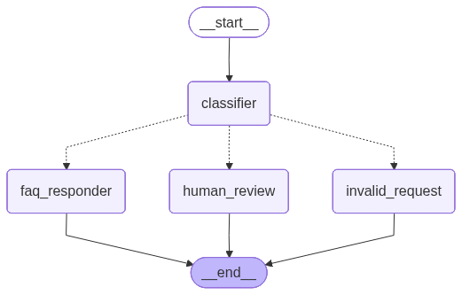

# Email Triage Agent (LangGraph)

This project is a small demo of an email triage workflow built with LangGraph
and Sarvam AI. It classifies incoming support emails and generates an
auto-reply based on the route.

## What this does

- Classifies each email into one of three routes: FAQ, Human, or Invalid.
- Replies with a matching FAQ answer when possible.
- Simulates a human review handoff with an interrupt and a suggested reply.
- Uses an in-memory checkpoint to show routing and resume behavior.
- Renders the workflow graph to a PNG on each run.

## Architecture

Nodes in the graph:
- `classifier` decides the route.
- `faq_responder` returns a FAQ answer.
- `human_review` triggers an interrupt and resumes with a reply.
- `invalid_request` returns a generic support-only response.

## How to run

1. (Optional) Create and activate a virtual environment.
	- Windows: `python -m venv myenv` then `myenv\Scripts\activate`
	- macOS/Linux: `python -m venv myenv` then `source myenv/bin/activate`
2. Install dependencies.
	- `pip install langchain-sarvam-ai langgraph langchain-core pydantic`
3. Set your API key (either option works).
	- Create a `.env` file:
	  - `SARVAM_API_KEY=your_key_here`
	- Or export it in your shell before running.
4. Run the demo.
	- `python main.py`

## Output

- Prints routing decisions and final replies for sample emails.
- Writes/overwrites `workflow.png` in the project root.